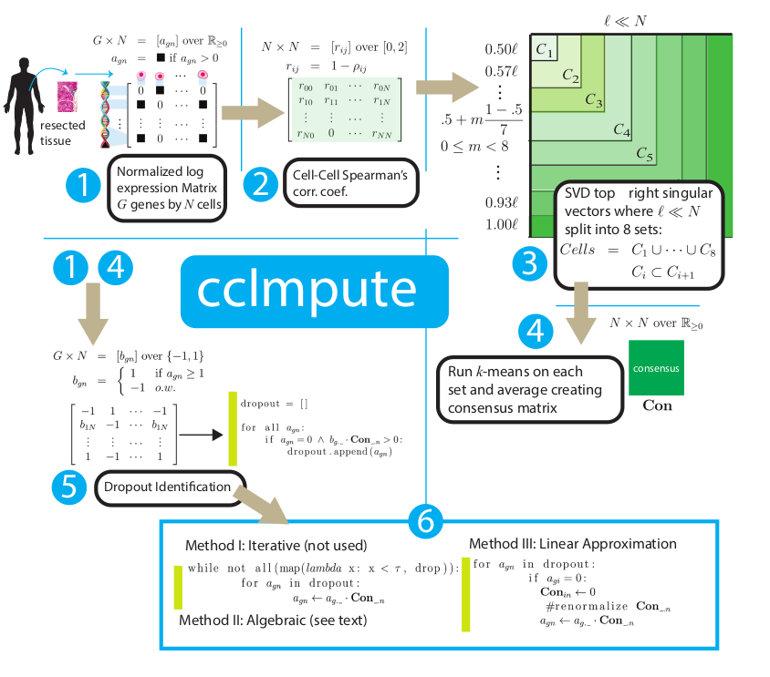
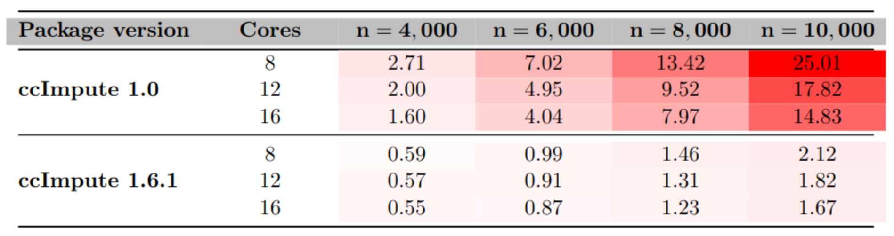

```{r, include = FALSE}
knitr::opts_chunk$set(
    collapse = TRUE,
    comment = "#>"
)
```
# Introduction
Single-cell RNA sequencing (scRNA-seq) is a powerful technique, but its
analysis is hampered by dropout events. These events occur when expressed genes
are missed and recorded as zero. This makes distinguishing true
zero expression from low expression difficult, affecting downstream analyses
like cell type classification. To address this challenge, we introduce ccImpute
[@malec2022ccimpute], an R  package that leverages consensus clustering. This
approach measures cell similarity effectively, allowing ccImpute to identify
and impute the most probable dropout events. Compared to existing methods,
ccImpute excels in two ways: it delivers superior performance and introduces
minimal additional noise, as evidenced by improved clustering on datasets with
known cell identities.

## Installation
```{r  eval=FALSE}
To install this package, start R (version "4.2") and enter:
if (!require("BiocManager", quietly = TRUE))
    install.packages("BiocManager")

BiocManager::install("ccImpute")
```

# Data Pre-Processing
`ccImpute` is an imputation tool that does not provide functions for
pre-processing the data. This tool expects the user to pre-process the data
before using it. The input data is expected to be in a log-normalized format
and accessible through the SingleCellExperiment object logcounts method. This
manual includes sample minimal pre-processing of a dataset from
[scRNAseq database](http://bioconductor.org/packages/scRNAseq) using the
[scater tool](http://bioconductor.org/packages/scater).

# Sample Usage
## Required libraries
```{r setup, message=FALSE, warning=FALSE}
library(scRNAseq)
library(scater)
library(ccImpute)
library(SingleCellExperiment)
library(stats)
library(mclust)
```

## Input Data
The code below loads the raw mouse neuron dataset from [@usoskin2015unbiased] 
and performs preprocessing steps to facilitate meaningful analysis, including
the computation of log-transformed normalized counts.
```{r message=FALSE, warning=FALSE}
sce <- UsoskinBrainData()
X <- cpm(sce)
labels <- colData(sce)$"Level 1"

#Filter bad cells
filt <- !grepl("Empty well", labels) &
        !grepl("NF outlier", labels) &
        !grepl("TH outlier", labels) &
        !grepl("NoN outlier", labels) &
        !grepl("NoN", labels) &
        !grepl("Central, unsolved", labels) &
        !grepl(">1 cell", labels) &
        !grepl("Medium", labels)
        
labels <-labels[filt]
X <- as.matrix(X[,filt])

#Remove genes that are not expressed in any cells:
X <- X[rowSums(X)>0,]

#Recreate the SingleCellExperiment and add log-transformed data:
ann <- data.frame(cell_id = labels)
sce <- SingleCellExperiment(assays = list(normcounts = as.matrix(X)), 
                            colData = ann)
logcounts(sce) <- log(normcounts(sce) + 1)
```
## Pre-processing data
A user may consider performing [feature selection
](https://bioconductor.org/books/3.15/OSCA.basic/feature-selection.html)
before running the imputation. ccImpute only imputes the most probable 
dropout events and is unlikely to benefit from the presence of scarcely 
expressed genes nor make any corrections to their expression.

## Adjusted Rand Index (ARI)
Adjusted Rand Index measures the similarity between two data clusterings
adjusted for the chance grouping of elements. This measure allows us to
evaluate the performance of the clustering algorithm as a similarity to the
optimal clustering assignments derived from cell labels.

## Compute Adjusted Rand Index (ARI) without imputation.
```{r}
# Set seed for reproducibility purposes.
set.seed(0) 
# Compute PCA reduction of the dataset
reducedDims(sce) <- list(PCA=prcomp(t(logcounts(sce)))$x)

# Get an actual number of cell types
k <- length(unique(colData(sce)$cell_id))

# Cluster the PCA reduced dataset and store the assignments
set.seed(0) 
assgmts <- kmeans(reducedDim(sce, "PCA"), centers = k, iter.max = 1e+09,
                    nstart = 1000)$cluster

# Use ARI to compare the k-means assignments to label assignments
adjustedRandIndex(assgmts, colData(sce)$cell_id)
```
## Perform the imputation with 2 CPU cores and fill in the 'imputed' assay.
```{r}
library(BiocParallel)
BPPARAM = MulticoreParam(2)
sce <- ccImpute(sce, BPPARAM = BPPARAM)
```
## Re-compute Adjusted Rand Index (ARI) with imputation.
```{r}
# Recompute PCA reduction of the dataset
reducedDim(sce, "PCA_imputed") <- prcomp(t(assay(sce, "imputed")))$x

# Cluster the PCA reduced dataset and store the assignments
assgmts <- kmeans(reducedDim(sce, "PCA_imputed"), centers = k, 
                    iter.max = 1e+09, nstart = 1000)$cluster

# Use ARI to compare the k-means assignments to label assignments
adjustedRandIndex(assgmts, colData(sce)$cell_id)
```
# ccImpute Algorithm Overview


ccImpute's takes the following steps: 

**(1) Input:** ccImpute starts with
a log-normalized expression matrix. 

**(2) Distance calculation:** Next,
ccImpute first computes the weighted Spearman distance between all the cells in
the data. 

**(3) Dimensionality reduction:** This is followed by a single
value decomposition (SVD) to reduce the distance matrix to the top $l$ most
informative singular vectors (typically $l = 0.08 \times min(n,2000)$). 

**(4) Clustering:** The algorithm then runs multiple instances of the 
k-means clustering algorithm in parallel (default: eight runs) on different 
subsets of these singular vectors with the results form to create a consensus 
matrix.

**(5) Dropout identification:** Using the consensus matrix and modified 
expression matrix, ccImpute identifies the most likely dropout events that need
imputed. 

**(6) Imputation:** Finally, ccImpute imputes the dropouts using a
weighted mean approach. It considers the influence of surrounding values,
assigning them weights from the consensus matrix. There are two options for
handling dropout values: either they are included in the weighting calculation
(Method I-II), or their influence is deliberately skipped (Method III).

# Key Analytical Choices
In the preceding section, we utilized the ccImpute method by providing only one
argument: the SingleCellExperiment object containing the scRNA-seq data.
Nevertheless, numerous parameters can be explicitly specified instead of
relying on default values. Here, we present the invocation of the ccImpute
method, including all the parameters with default values assigned:
```{r, eval=FALSE}
ccImpute(sce, dist, nCeil = 2000, svdMaxRatio = 0.08,
            maxSets = 8, k, consMin=0.75, kmNStart, kmMax=1000,
            fastSolver = TRUE, BPPARAM=bpparam(), verbose = TRUE)
```
This function can be decomposed into a series of steps, providing finer control
over the execution of the ccImpute algorithm:
```{r, eval=FALSE}
cores <- 2
BPPARAM = MulticoreParam(cores)

w <- rowVars_fast(logcounts(sce), cores)
corMat <- getCorM("spearman", logcounts(sce), w, cores)

v <- doSVD(corMat, svdMaxRatio=.08, nCeil=2000, nCores=cores)

consMtx <- runKM(logX, v, maxSets = 8, k, consMin=0.75, kmNStart, kmMax=1000, 
                    BPPARAM=bpparam())
                    
dropIds <- findDropouts(logX, consMtx)

iLogX <- computeDropouts(consMtx, logX, dropIds, 
                            fastSolver=TRUE, nCores=cores)
assay(sce, "imputed") <- iLogX
```
In the following sections, we will examine these parameters in more detail and
clarify their influence on the imputation performance. For a detailed
description of each input argument, please consult the reference manual.

## Distance/Similarity Measures
By default, if the dist parameter is not specified in the ccImpute function,
the ccImpute algorithm employs a weighted Spearman correlation measure between
cells, with weights corresponding to gene variances. However, any distance or 
correlation matrix can be utilized for this parameter. Furthermore, the package
provides the getCorM function, which can efficiently compute correlations and
weighted correlations. Here is an example of using this method to compute 
Pearson correlation in parallel using 2 cores:
```{r, eval=FALSE}
corMat <- getCorM("pearson", logcounts(sce), nCores=2)
```
## Singular Value Decomposition (SVD)
In the singular value decomposition step that follows the computing of the
distance matrix, the $nCeil$ parameter specifies the maximum number of cells 
used to compute the range of top singular vectors. The number of singular 
vectors used in clustering runs is in 
$[.5N \times svdMaxRatio, N \times svdMaxRatio]$. However, with high enough N, 
the imputation performance drops due to increased noise that is introduced. 
Experimental data suggest that parameters $NCeil = 2000$, and 
$svdMaxRatio = 0.08$ results in optimal performance. However, different values
may work better depending on the distance measure used and how other
parameters are modified.

## Clustering: k,  kmMaxIter, kmNStart
The clustering step employs the k-means algorithm, which requires choosing the
number of clusters (k), the maximum number of iterations (kmMaxIter), and the 
number of times the algorithm is repeated (kmNStart). Ideally, k should match 
the actual number of cell types in the dataset. However, overestimating k can
still result in good imputation quality. If k is not specified, it is estimated
using the Tracy-Widom bound but should be reviewed for correctness.

kmMaxIter sets the maximum iterations for each k-means run and defaults
to 1000. kmNStart determines how many times the k-means algorithm is repeated.
Repetition allows for different initial cluster selections, which can improve
clustering quality. K-means is sensitive to initial centroid choices, typically
random data points, and repetition mitigates the risk of suboptimal results. 
If kmNStart is not set, k-means runs $1000$ times for $N <= 2000$ and $50$
times otherwise.

\subsection{Parallel Computation: bpparam}
The bpparam parameter controls parallel execution within this package,
leveraging the BiocParallel package's capabilities. BiocParallel manages
parallel execution for k-means clustering and determines the number of cores
available for subsequent computations using the openMP library 
(if ccImpute function is used) or a user-specified value. It's recommended to 
set the number of cores parameters to match the number of physical cores on
your system for optimal performance.
This is an example of threaded parallel computation with 4 cores:
```{r, eval=FALSE}
BPPARAM = MulticoreParam(4)
sce <- ccImpute(sce, BPPARAM = BPPARAM)
```

Additionally, using parallel and fast BLAS libraries linked to R can
significantly speed up the imputation. The RhpcBLASctl library allows you to
control the number of threads used by the BLAS library. For example, to use 
4 cores:
```{r, eval=FALSE}
library(RhpcBLASctl)
blas_set_num_threads(4)
```
# Runtime Performance


The latest release of ccImpute demonstrates substantial performance
improvements over its initial version, particularly when handling larger
datasets. To quantify these enhancements, we measured runtime (RT) in minutes
across various combinations of processing cores and dataset sizes
(denoted by n).

A heatmap visualization reveals that runtime is indicated by red shades, with
lighter shades signifying faster performance. The benchmark was conducted on a
system equipped with an Intel Xeon Platinum 8268 24-core CPU, 1.5 TB of RAM, 
and utilized R 4.3.3 with OpenBlas v0.3.20 (pthread variant).

The results unequivocally demonstrate that the current release of ccImpute
significantly outperforms its predecessor, especially with larger datasets.
This performance gain is consistent across all tested core configurations,
underscoring the effectiveness of the enhancements in optimizing ccImpute for
practical, real-world applications.

# R session information.
```{r reproduce3, echo=FALSE}
## Session info
library("sessioninfo")
options(width = 120)
session_info()
```

# References
